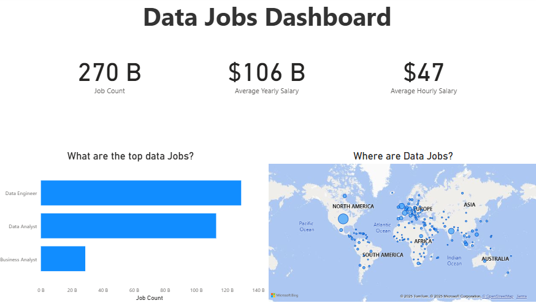

# Power BI - First Dashboard Project

This repository contains a Power BI `.pbix` file named **First Dashboard**, created as part of my data analytics learning journey. The dashboard demonstrates basic Power BI capabilities such as data modeling, visualizations, and filtering.

---

## 📊 Dashboard Highlights

- Overview of sample dataset
- Visuals created using bar charts, slicers, and cards
- Interactive filters for better user experience
- Clean and beginner-friendly layout

---

## 🧩 File

- `first_dashboard.pbix` – The Power BI Desktop file.  
  Open this file using [Power BI Desktop](https://powerbi.microsoft.com/en-us/desktop/).

---

## 🖼 Preview

*(Optional – include if you upload screenshots to the `/images` folder)*

---

## 🚀 How to Use

1. Clone or download the repository.
2. Open `first_dashboard.pbix` in Power BI Desktop.
3. Explore the visuals, filters, and dataset.

---

## 🛠 Tech Stack

- **Power BI Desktop**
- Sample data embedded or imported (Excel, CSV, or mock data)

---

## 📌 Purpose

This is a beginner-level Power BI project created to practice data visualization, layout design, and interactivity in dashboards.

---

## 📬 Contact

If you have feedback or suggestions, feel free to reach out:  
📧 areisoglu@proton.me 
📍 [LinkedIn](https://www.linkedin.com/aykutreisoglu) (you can update this with your real profile)
